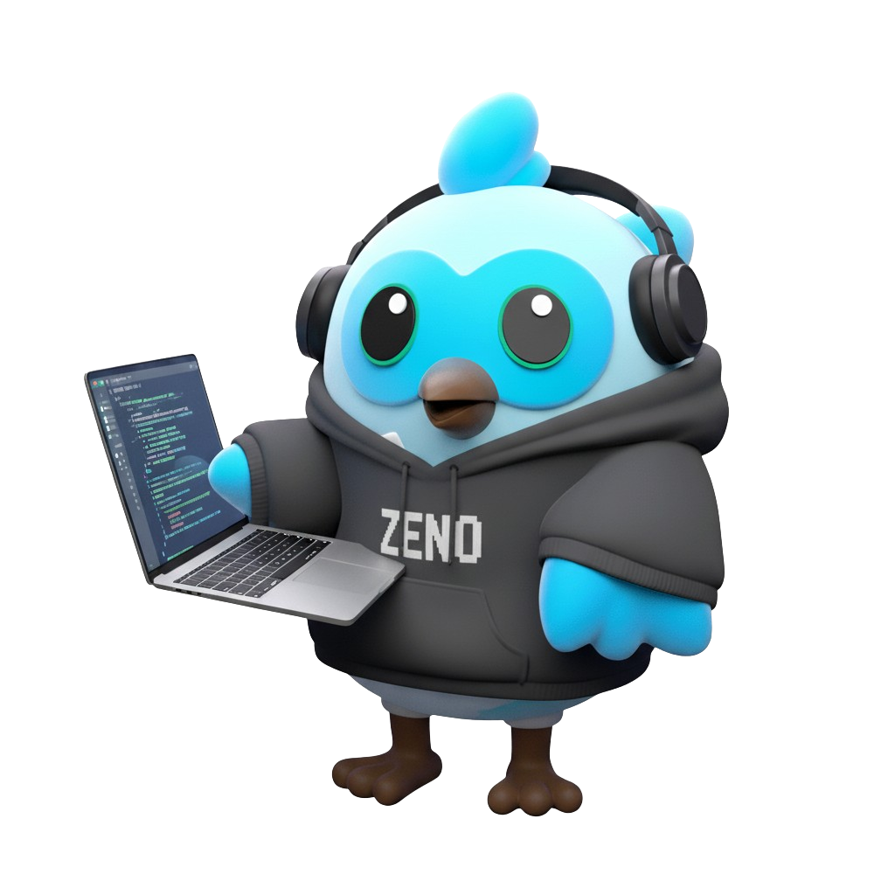

# Zeno


[](https://pub.dev/packages/very_good_analysis)
[](https://opensource.org/licenses/MIT)

A fast and intelligent hot reload utility for Dart applications written in Dart 💙

## Features

- **Zero-downtime hot reload** - Gracefully swaps binaries without stopping your application
- **Intelligent file watching** - Monitors only relevant files with configurable filters
- **Cross-platform compatibility** - Supports native file watching and polling modes
- **Flexible configuration** - YAML-based configuration with sensible defaults
- **Build lifecycle hooks** - Run pre/post commands during build process
- **Advanced process management** - Handles graceful shutdowns and automatic recovery
- **Development proxy support** - Built-in proxy for web applications with live reload
- **Comprehensive logging** - Configurable logging levels and output options


## Quick Start

### Installation

Install Zeno globally using Dart's package manager:

```bash
dart pub global activate zeno
```

Or install from source:

```bash
dart pub global activate --source=path <path-to-zeno>
```


### Basic Usage

1. **Initialize a new project**:

```bash
zeno init
```

2. **Configure your build** (edit `zeno.yml`):

```yaml
build:
  cmd: "dart compile exe lib/main.dart -o ./tmp/main.exe"
  bin: ./tmp/main.exe
```

3. **Start hot reloading**:

```bash
zeno
```


That's it! Zeno will watch your files and automatically reload your application when changes are detected.

## Configuration

Zeno uses a `zeno.yml` configuration file with the following structure:

### Build Configuration

```yaml
build:
  # Build command that outputs to a temporary location
  cmd: "dart compile exe lib/main.dart -o ./tmp/main.exe"
  
  # Path to your application binary
  bin: ./tmp/main.exe
  
  # Arguments to pass to your application
  args: []
  
  # File extensions to watch
  include_ext:
    - dart
  
  # Directories to exclude from watching
  exclude_dir:
    - build
    - .dart_tool
    - tmp
    - test
  
  # Build lifecycle hooks
  pre_cmd: []   # Commands to run before build
  post_cmd: []  # Commands to run after build
  
  # Timing configuration (milliseconds)
  delay: 1500        # Debounce delay before rebuilding
  kill_delay: 1500   # Graceful shutdown timeout
  
  # Build behavior
  stop_on_error: false      # Continue on build failures
  exclude_unchanged: true   # Skip unchanged files
  follow_symlink: false     # Follow symbolic links
  
  # File watching method
  poll: false           # Use polling instead of native watching
  poll_interval: 500    # Polling interval in milliseconds
```


### Advanced Configuration

```yaml
# Logging configuration
log:
  add_time: false    # Add timestamps to logs
  main_only: false   # Log only main process output
  silent: false      # Suppress all output

# Development proxy for web applications
proxy:
  enabled: false
  proxy_port: 8090
  app_port: 8080

# Terminal display options
screen:
  clear_on_rebuild: false  # Clear screen on each rebuild
  keep_scroll: true        # Maintain scroll position

# Cleanup settings
misc:
  clean_on_exit: true  # Remove temporary files on exit
```


## Commands

| Command             | Description               | Options                 |
| :------------------ | :------------------------ | :---------------------- |
| `zeno` / `zeno run` | Start hot reloading       | `--config`, `--verbose` |
| `zeno init`         | Create configuration file | None                    |
| `zeno update`       | Update to latest version  | None                    |
| `zeno --help`       | Display help information  | None                    |

## How It Works

Zeno implements **zero-downtime deployment** through intelligent binary swapping:

1. **Initial Build**: Compiles your application to the configured binary path
2. **File Watching**: Monitors specified directories for file changes
3. **Incremental Build**: When changes are detected, builds a new version with a temporary name
4. **Graceful Restart**:
    - Gracefully terminates the current process
    - Swaps the old binary with the new one
    - Starts the updated application
    - Cleans up temporary files

This approach ensures your application experiences minimal downtime during development.

## File Watching Options

| Feature                   | Description                                 | Default         |
| :------------------------ | :------------------------------------------ | :-------------- |
| **Extension filtering**   | Watch only specific file types              | `[dart]`        |
| **Directory exclusion**   | Skip build directories and dependencies     | Enabled         |
| **Regex patterns**        | Advanced filtering with regular expressions | None            |
| **Include/exclude lists** | Fine-grained control over watched files     | Configurable    |
| **Polling mode**          | Cross-platform compatibility fallback       | Native watching |

## Development Workflow

Integrate Zeno into your development process:

```yaml
build:
  # Pre-build tasks
  pre_cmd:
    - "dart run build_runner build"
    - "flutter packages get"
  
  # Main build command
  cmd: "dart compile exe lib/main.dart -o ./tmp/main.exe"
  
  # Post-build tasks
  post_cmd:
    - "echo 'Build completed successfully'"
```


## Requirements

- **Dart SDK**: Version 3.5.0 or higher
- **Operating System**: Windows, macOS, or Linux
- **File System**: Native file watching support (polling available as fallback)


## Architecture

Zeno consists of several core components:

- **ZenoEngine**: Main orchestrator coordinating all operations
- **ZenoBuildRunner**: Manages build processes and lifecycle
- **ZenoFileWatcher**: Intelligent file system monitoring
- **ZenoProcessManager**: Application process lifecycle management
- **ZenoConfig**: YAML-based configuration management


## Troubleshooting

### Common Issues

| Issue                      | Solution                                               |
| :------------------------- | :----------------------------------------------------- |
| Build failures not showing | Check `build-errors.log` in temp directory             |
| File watching not working  | Enable polling mode: `poll: true`                      |
| Permission errors          | Ensure write access to temp and binary directories     |
| High CPU usage             | Reduce watched directories or increase `poll_interval` |
| Process won't restart      | Check binary permissions and paths                     |

### Debug Mode

Enable verbose logging to diagnose issues:

```bash
zeno run --verbose
```


## Contributing

We welcome contributions! Please see our contribution guidelines for:

- Reporting bugs
- Suggesting features
- Submitting pull requests
- Development setup